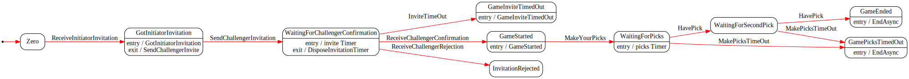

# Stealth Challenge

## Projects

csproj | desc | dependencies
---|---|---
StealthChallenge.Abstractions | base assembly, contains only contracts and models | X
StealthChallenge.Domain | data services/repositories | StealthChallenge.Abstractions
StealthChallenge.Logging | Serilog log impl | StealthChallenge.Abstractions, `serilog`
StealthChallenge.Infrastructure | concerns like tcp communication, match making | StealthChallenge.Abstractions
StealthChallenge.StateMachine | game engine state machine | StealthChallenge.Abstractions, `stateless`
StealthChallenge.Tests | unit tests | `xunit`, `nsubstitute`

## Misc

- initial commit contains:
  - solution scaffolding
  - complete & tested implementation of a finite state machine for a rock, paper, scissors game.

## state machine

