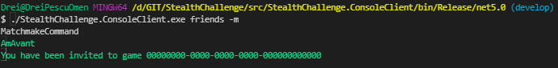
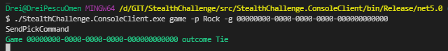

# Stealth Challenge

## Projects

csproj | desc | dependencies
---|---|---
StealthChallenge.Abstractions | base assembly, contains only contracts and models | BCL
StealthChallenge.Api | server net5.0 webapi | all projects except clients
StealthChallenge.ConsoleClient | console client app | StealthChallenge.MessagePack
StealthChallenge.Domain | data services/repositories | StealthChallenge.Abstractions
StealthChallenge.Infrastructure | concerns like tcp communication, match making | StealthChallenge.Abstractions
StealthChallenge.Logging | Serilog log impl | StealthChallenge.Abstractions, `serilog`
StealthChallenge.MessagePack | binary serialization over TCP | StealthChallenge.Abstractions, `messagepack`
StealthChallenge.StateMachine | game engine state machine | StealthChallenge.Abstractions, `stateless`
StealthChallenge.Tests | unit tests | `xunit`, `nsubstitute`

## state machine


## run

client in debug folder has user name _AmAvant_, client in release folder _Noob_.

_AmAvant_ lists friends


_AmAvant_ searches possible matches


_Noob_ has a socket open, receives game invite from server.



_AmAvant_ invites _Noob_ to a new game...

After _Noob_ accepts, _AmAvant_ receives notification from server.


_Noob_ accepts


Both send picks.

Event driven outcome notification..




## server logs

Follow the same run flow from the server ..

```sh
[09:21:55 INF]  Now listening on: http://[::]:8765
[09:21:55 INF]  Now listening on: http://[::]:54321
[09:21:55 INF]  Application started. Press Ctrl+C to shut down
[09:22:36 INF]  Handling command {"User": "AmAvant", "$type": "GetFriendsListCommand"}
[09:22:58 DBG]  Connection id "0HMAN20V7JLVD" sending FIN because: "The Socket transport's send loop completed gracefully."
[09:22:49 INF]  Handling command {"User": "AmAvant", "$type": "MatchmakeCommand"}
[09:24:02 INF]  Handling command {"Challenger": "Noob", "User": "AmAvant", "$type": "InviteCommand"}
[09:24:05 INF]  Handling command {"User": "Noob", "$type": "MatchmakeCommand"}
[09:25:15 INF]  Handling command {"GameId": "00000000-0000-0000-0000-000000000000", "User": "Noob", "$type": "AcceptInvitationCommand"}
[09:25:15 INF]  Received challenger confirmation for game 00000000-0000-0000-0000-000000000000
[09:25:15 DBG]  Invite timer disposed for game 00000000-0000-0000-0000-000000000000
[09:25:15 INF]  Game 00000000-0000-0000-0000-000000000000 started
[09:25:47 INF]  Handling command {"Pick": "Rock", "GameId": "00000000-0000-0000-0000-000000000000", "User": "AmAvant", "$type": "SendPickCommand"}
[09:26:04 INF]  Handling command {"Pick": "Rock", "GameId": "00000000-0000-0000-0000-000000000000", "User": "Noob", "$type": "SendPickCommand"}
[09:26:04 DBG]  Picks timer disposed for game 00000000-0000-0000-0000-000000000000
[09:35:48 DBG]  Connection id "0HMAN20V7JLVI" reset.
[09:35:48 DBG]  Connection ["0HMAN20V7JLVI"] disconnected
[09:35:48 DBG]  Connection id "0HMAN20V7JLVI" sending FIN because: "The Socket transport's send loop completed gracefully."
[09:35:54 DBG]  Connection id "0HMAN20V7JLVH" reset.
[09:35:54 DBG]  Connection ["0HMAN20V7JLVH"] disconnected
[09:35:54 DBG]  Connection id "0HMAN20V7JLVH" sending FIN because: "The Socket transport's send loop completed gracefully."
```